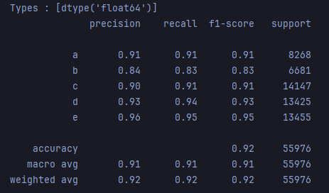
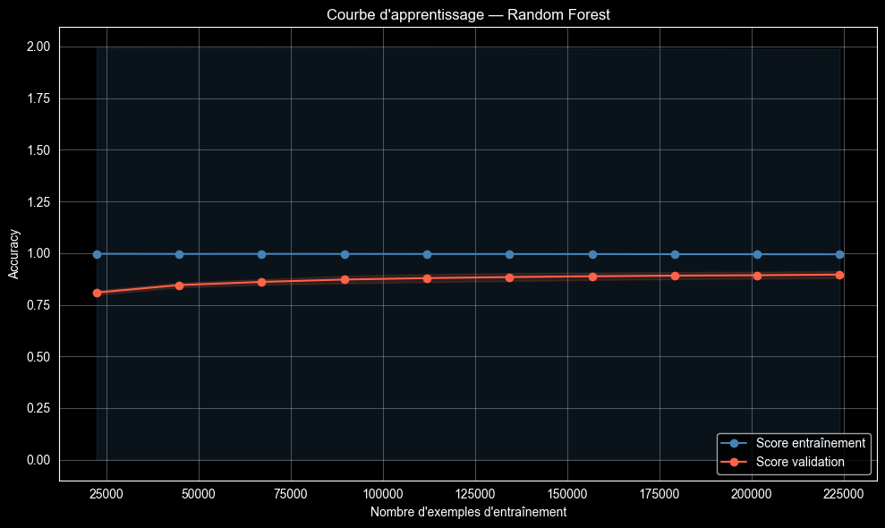
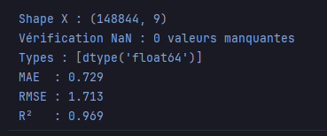
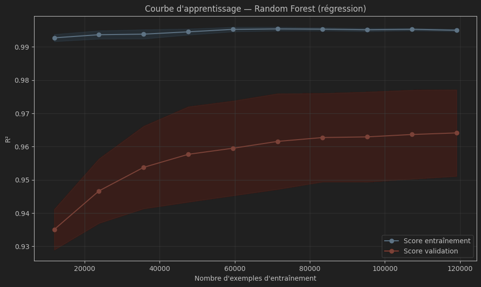
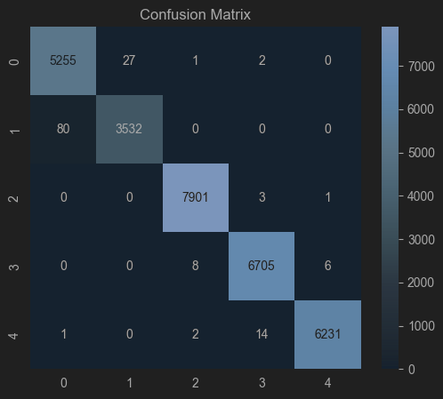
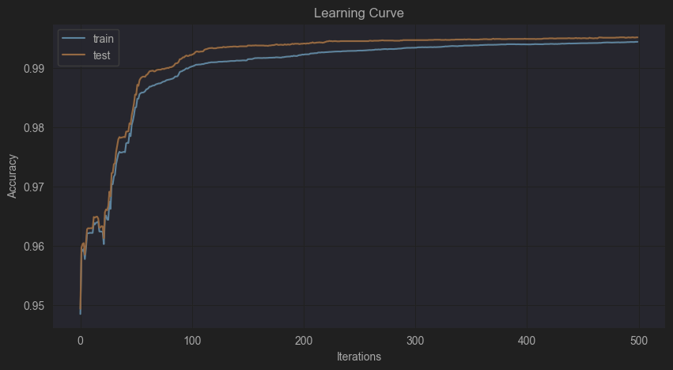
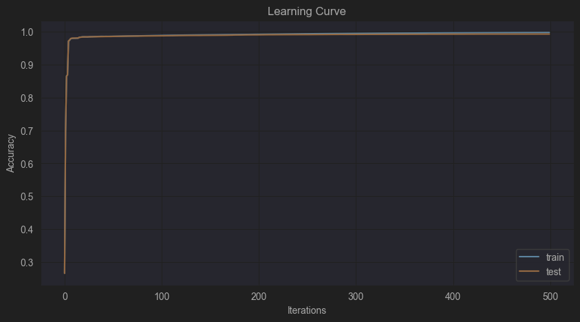

# Documentation

## Nutriscore


ont as un range de -17 à 59 où :
- A est entre -17 et 0
- B est entre 1 et 2
- C est entre 3 et 10
- D est entre 11 et 18
- E est entre 19 et 59


## Modèles choisi pour les tests

On liste les modèles suivants pour être tester sur nos données :
- LightGBM / XGBoost
- CatBoost
- Random Forest
- Logistic Regression
- Réseau de neuronnes

## Traitement apporté au jeu de données

On garde les colonnes suivantes :

Cibles et identification :
    "code", "product_name", "main_category", "nutriscore_grade", "nutriscore_score",

Points négatifs du Nutri-Score :
    "energy_100g", 
    "sugars_100g", 
    "saturated-fat_100g", 
    "sodium_100g", 

Points positifs du Nutri-Score :
    "proteins_100g", 
    "fiber_100g", 
    "fruits-vegetables-legumes_100g",

Variables globales utiles au modèle :
    "fat_100g",
    "carbohydrates_100g"

On retire ensuite les lignes où nutriscore_grade, nutriscore_score et energy_100g 
valent NaN, unknown ou not-applicable ce qui supprime 4148649 lignes
## Models, entrainement et choix

### Random Forest
Après avoir nettoyé et rendu le dataset un maximum utilisable et le plus clair possible, on utilise le modèle RandomForest pour le tester et observer les résultats sur ce dataset. 

On cherche à déterminer ici le nutriscore_grade, la lette qui correspond donc au nutriscore. 

On utilise 100 itérations sur le modèle et on regarde ce que les métriques donnent.

Pour chaque lettre allant de A à E, on retrouve une precision plutôt similaire et stable, aux alentours de 0.90 (avec une allonge allant de 0.84 jusqu'à 0.96),
avec le recall et le f1-score ayant les mêmes valeurs à peu près.



Maintenant on va observer la learning curve de notre modèle, et on peut voir que notre score de validation avoisine les 0.90.

Grade :



Ensuite on va chercher à prédire le nutriscore_score, le score tout simplement.
On obtient un score RMSE de 1713 et un score de R² de 0.969.



Pour la learning curve on obtient un score de validation autour de 0.965.

Score :


Globalement, pour les 2 tests, on obtient des scores convaincants et élevés mais le modèle étant un modèle plutôt simple, on pourrai obtenir de meilleurs scores avec des modèles plus complexes. 

### Nutriscore Score

XGBoost
Après avoir testé les modèles de base, nous utilisons l'algorithme XGBoost pour prédire le nutriscore_score. Ce modèle de boosting d'arbres est configuré avec 150 itérations et une profondeur de 7 pour capturer les relations non-linéaires entre les nutriments.

Résultats de la Validation Croisée (5 Folds) :
Le modèle présente une excellente stabilité avec une erreur moyenne très faible.

MAE Moyenne Globale : 0.855 points

Écart-type (StDev) : 0.008 points

L'erreur est inférieure à 1 point de Nutri-Score, ce qui témoigne d'une précision remarquable pour un score allant de -17 à 59.

Importance des caractéristiques :
Les trois variables dominantes pour XGBoost sont :

Acides gras saturés (35.6%)

Sucres (22.2%)

Sodium (18.3%)

Ces trois composants représentent à eux seuls plus de 75% de la décision du modèle, ce qui est cohérent avec le calcul officiel du Nutri-Score où ces éléments constituent les principaux "points négatifs".

CatBoost (Régression)
En parallèle, le modèle CatBoost a été testé avec 200 itérations et une profondeur de 6. Contrairement au test de classification des grades (A-E), nous cherchons ici à prédire la valeur numérique exacte du score.

Résultats de la Validation Croisée (5 Folds) :
Les performances sont légèrement moins élevées que celles de XGBoost sur cette tâche spécifique, mais restent très solides et homogènes sur tous les folds.

MAE Moyenne Globale : 0.973 points

Écart-type (StDev) : 0.007 points

L'erreur reste extrêmement contenue (en dessous de 1 point), confirmant la robustesse des modèles de boosting pour ce jeu de données.

Importance des caractéristiques :
Le classement des variables diffère légèrement de XGBoost :

Les sucres arrivent en tête (27.1%), suivis du sodium (23.8%) et des acides gras saturés (21.1%).

On note que la variable main_category (4.0%) a un impact plus marqué ici que dans XGBoost, ce qui suggère que CatBoost exploite mieux la nature catégorielle des produits pour affiner le score.

Comparaison des modèles
Pour la prédiction du score numérique, XGBoost s'avère être le modèle le plus performant avec une MAE de 0.855, contre 0.973 pour CatBoost. Cependant, les deux modèles montrent une absence quasi-totale de surapprentissage, l'écart entre les différents folds de validation étant infime (StDev < 0.01).

### Nutriscore Grade 
Catboost est le meilleur model
avec comme hyperparamètres :
- iterations=500
- learning_rate=0.05
- depth=6

Catboost utilise principalement main_category et energy_100g 

en 466 itérations ont obtient un test de 0.9951291612 ce qui nous
donne un classification report tel quel :

```
Accuracy : 0.995129161207968Accuracy : 0.995129161207968
              precision    recall  f1-score   support

           a       0.98      0.99      0.99      5285
           b       0.99      0.98      0.99      3612
           c       1.00      1.00      1.00      7905
           d       1.00      1.00      1.00      6719
           e       1.00      1.00      1.00      6248

    accuracy                           1.00     29769
   macro avg       0.99      0.99      0.99     29769
weighted avg       1.00      1.00      1.00     29769
```
Erreurs notables

- Classe 1(b) est la plus difficile à classer : 80 exemples de la classe 1 sont prédits comme classe 0. C'est l'erreur la plus significative du modèle, suggérant que ces deux classes partagent des caractéristiques proches.
- Classe 0(a) génère également 27 confusions vers la classe 1, confirmant que la frontière 0/1 est la plus ambiguë.
- Les classes 2(b), 3(c) et 4(d) sont très bien séparées, avec seulement quelques confusions entre voisines (3↔4 notamment : 14 cas).

Le principal axe d'amélioration réside dans la discrimination entre les classes 0 et 1.



Le modèle as d'excellentes performances globales, avec une accuracy 
qui atteint 99,3–99,4% aussi bien sur le train que sur le test à 500 itérations.
Avec une convergence rapide en une 100aine d'itérations et une absence de sur apprentissage.



XGBoost just après Catboost en thèrme de performances 
avec comme hyperparamètres :
- iterations=500
- learning_rate=0.05
- depth=6

XGBoost utilise principalement energy_100g  et protein_100g

en 488 itérations ont obtient un test de 0.9932816016661628 ce qui nous
donne un classification report tel quel :

```
Accuracy : 0.9932816016661628
              precision    recall  f1-score   support

           a       0.98      0.99      0.98      5285
           b       0.99      0.97      0.98      3612
           c       1.00      1.00      1.00      7905
           d       1.00      1.00      1.00      6719
           e       1.00      1.00      1.00      6248

    accuracy                           0.99     29769
   macro avg       0.99      0.99      0.99     29769
weighted avg       0.99      0.99      0.99     29769
```
Erreurs notables

- Classe b reste la plus difficile : 113 exemples de b sont prédits comme a, c'est l'erreur dominante du modèle. La frontière a/b est clairement la plus ambiguë, comme avec CatBoost.
- Classe a génère 45 confusions vers b, confirmant la symétrie de la confusion a↔b.
- Les classes c, d et e sont très bien séparées, avec seulement quelques fuites vers les voisines (d↔e : 20 cas, d↔c : 8 cas).

Comparaison avec CatBoost
- Recall classe a 99,4% | 99,1%
- Recall classe b 97,8% | 96,9%
- Recall classe c 99,9% | 99,97%
- Recall classe d 99,8% | 99,8%
- Recall classe e 99,7% | 99,6%


- Confusion a↔b 80+27 = 107113+45 = 158

CatBoost reste légèrement supérieur, notamment sur la classe b où XGBoost génère ~50% d'erreurs supplémentaires sur la frontière a/b. Cela s'explique en partie par le fait que CatBoost gère les variables catégorielles nativement, sans encodage, ce qui préserve mieux l'information ordinale des features textuelles du Nutri-Score.

Conclusion
XGBoost livre de très bonnes performances (~99% d'accuracy globale), mais CatBoost conserve un léger avantage sur ce jeu de données, probablement grâce à son traitement natif des catégorielles. Le point faible commun aux deux modèles reste la frontière a/b, ce qui suggère une piste d'amélioration partagée indépendante du choix du modèle.


Le modèle converge vers une accuracy de ~99,9% sur les deux sets, avec une montée extrêmement rapide dès les premières itérations.

La courbe est presque verticale entre les itérations 0 et ~20, passant de ~28% à ~97% en quelques arbres seulement. C'est nettement plus brutal que CatBoost qui montait progressivement jusqu'à ~100 itérations.
Cela reflète le comportement classique de XGBoost

Les courbes train et test sont quasiment superposées sur toute la trajectoire, indissociables à l'œil nu. C'est un signal de généralisation parfaite. Contrairement à CatBoost où la courbe test était légèrement au-dessus du train (effet de l'ordered boosting), ici les deux progressent en parfaite symétrie, signe que la régularisation par défaut de XGBoost (reg_lambda=1, reg_alpha=0) est suffisante sur ce jeu de données.



Conclusion
La learning curve XGBoost est exemplaire : convergence fulgurante, généralisation parfaite, aucun signe d'overfitting. Combinée à la matrice de confusion, elle confirme qu'XGBoost est un modèle très solide sur ce dataset, même s'il reste légèrement en retrait de CatBoost sur la discrimination des grades a/b.